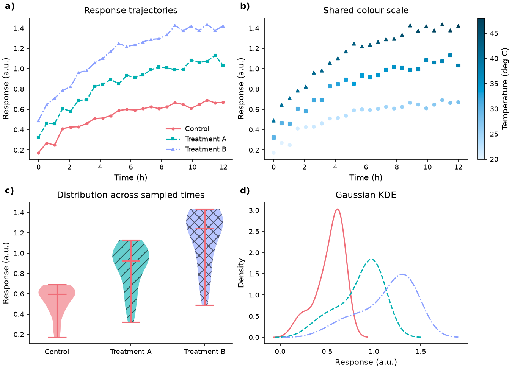

# mudplot

*[English docs: README.md](README.md)*

논문용 그래프를 위한 Python 플롯 라이브러리. Matplotlib 위에서
**지각적으로 균일하고(perceptually uniform), 적녹 색맹 안전한(colorblind-safe)**
색상 팔레트와 스타일을 제공합니다.

핵심은 **LCH(CIELAB 극좌표) 기반 색상 엔진**입니다.

- **같은 명도(L\* 고정)** → 흑백 인쇄/명암에서 공정
- **최대 대조** → 색상 간 지각 색차(CIEDE2000)의 최솟값을 최대화
- **색맹 고려** → 일반 시각 + protanopia/deuteranopia 시뮬레이션의 최악 대조를
  최적화(`Palette.report()`로 직접 측정한 값이며, 인증된 접근성 기준은 아님);
  아래 [검증된 명칭 팔레트](docs/DEMO.md#4-colour-palette-presets-measured-not-assumed)
  참고
- **흑백 인쇄 안전** → 그룹화된 bar/box/violin 도 기본적으로 해칭 패턴을 함께
  사용해, 색상이 비슷해져도 막대이 구별됩니다 —
  [흑백 인쇄 데모](docs/DEMO.md#5-grouped-bar-chart-readable-after-black--white-printing)
  참고

## 아키텍처: Spec 중심 + 순수 reducer (functional core / imperative shell)

그림의 모든 상태를 **직렬화 가능한 선언적 `FigureSpec`** 으로 표현하고,
상태 전이는 **순수 reducer**로만 수행한다. effect(render/io/preview)는
가장자리로 분리.

```
 Action (순수 데이터)
     │
     ▼  reduce(state, action) -> state'      ─┐ functional core (순수)
 FigureSpec (dataclass ⇆ JSON, .mplot.json) ─┘
     │
     ▼  render / io / preview                ── imperative shell (effect)
 matplotlib → PNG/PDF/SVG
```

- fluent 빌더는 **action을 dispatch하는 설탕** — `Store`가 reducer 구동.
- `mudplot/` 엔진은 UI 의존 없음. `dashboard/`는 별도 패키지(추후).
- Python과 미래 Rust GUI가 오직 같은 action/JSON 스키마로 소통.

## 상태

**v0.3.0**, pre-1.0으로 빠르게 진행 중. 아키텍처/전체 마일스톤은
[`DESIGN.md`](DESIGN.md), 버전별 상세 내역은 [`CHANGELOG.md`](CHANGELOG.md),
다음 단계는 [`ROADMAP.md`](ROADMAP.md) 참고.

**엔진 (`mudplot/`) — 지금 바로 사용 가능, 테스트 345개 통과:**

- [x] 색 엔진: sRGB ↔ linear ↔ XYZ ↔ Lab ↔ LCH (numpy 전용); CIE76/CIEDE2000
      색차(Sharma 2005 검증값); Machado 2009 색맹 시뮬레이션; qualitative/
      sequential/diverging 팔레트 생성기 + preview
- [x] **이름 붙은 검증된 qualitative 팔레트 프리셋 3종** (`paper`/`vivid`/
      `soft`) — 명시된 카테고리 수까지 CVD·진짜 흑백 안전성을 직접 측정;
      bar/box/violin도 기본적으로 그룹마다 해칭 패턴을 함께 사용해 색상
      개수와 무관하게 흑백 인쇄에서 구별됨
- [x] 선언적 Spec 모델(`FigureSpec`) + 무손실 JSON 왕복 + 순수 reducer +
      action + store (`Store.undo()`/`redo()`) — render/io/preview 등
      effect는 가장자리로 분리
- [x] 렌더러: 레이어 21종(line/scatter/bar/errorbar/band/hline/vline/text/
      annotate/hist/box/violin/kde/heatmap/contour/contourf/pie/scatter3d/
      line3d/surface/wireframe), 멀티패널 레이아웃, 보조 y축, 공유축,
      despine, 외부 범례, 연속값 컬러매핑 + colorbar
- [x] **TeX 대응 크기 지정과 겹치지 않는 레이아웃**: `.tex_size(preset,
      columns=1|2)`로 실제 figure를 문서 컬럼폭/전체 텍스트폭에 맞춤;
      `render()`가 넘치는 제목을 자동 줄바꿈하고 외부 범례를 위한 캔버스
      여백을 자동 확보(matplotlib 자체 레이아웃 엔진 + 텍스트 측정
      렌더러 사용, 직접 만든 레이아웃 시스템 없음)해 지정한 물리적
      크기를 유지하면서도 텍스트가 잘리거나 겹치지 않음 — TeX WYSIWYG
      `.preview()`(article/ieee/revtex/nature/acm)의 기반이기도 함
- [x] **정확한 위치 지정**: 범례(`.legend(bbox_to_anchor=...)`), 패널
      제목(`.title_position(...)`), `text`/`annotate` 레이어
      (`.set_layer_at(...)`)를 정확한 위치에 고정 — 인터랙티브 에디터의
      드래그 핸들도 이 기능을 사용
- [x] **LaTeX 네이티브 참조**: 범례 항목이나 패널 제목에 BibTeX 키·URL을
      연결. `.pgf` 내보내기는 `\figcite{}`/`\href{}`를 남겨 논문의
      bibliography·hyperref가 해석하고, SVG는 클릭 가능한 링크, 래스터는
      일반 텍스트로 처리(tectonic으로 실제 논문을 컴파일해 PDF에서 번호를
      다시 읽어 검증)
- [x] 순수 코어 의존성 0(numpy/matplotlib은 effect 전용 extras); 다양한
      입력 형식(dict/records/DataFrame/numpy/pyarrow/SQL) 지원; AI
      에이전트 친화 인터페이스(`capabilities()`/`json_schema()`/
      `apply()`/`action_log`); 렌더링 전 자동 실행되는 순수
      `validate()`/`assert_valid()`
- [x] CLI (`python -m mudplot capabilities|schema|docs|validate|render`);
      JSON 스키마/capabilities/docs export 파일 + CI 동기화 검증
- [x] 안정성 하드닝 3회, 실제 버그 약 20건 발견/수정 후 회귀 테스트로
      잠금 (저널 크기 미적용, Store 상태 외부 변형 유출, 범주형 좌표가
      레이어·패널 간 불일치, `save()`가 지정 크기를 무시하고 자동 크롭
      등) — 자세한 내용은 `DESIGN.md` §4c2,
      `tests/test_bugfixes.py`/`tests/test_stabilization.py`

**대시보드 (`dashboard/`, 별도 패키지) — 사람용, 프로토타입 수준:**

- [x] 엔진 자기소개 기반 문서 + 디자인 갤러리 정적 사이트
      (`python -m dashboard build`)
- [x] 로컬 인터랙티브 에디터(`python -m dashboard serve`) — fluent API와
      동일한 Store/action/reducer 사용. 한 서버 안에 **Editor**/**Docs**
      탭, htmx 부분 갱신(전체 리로드 없음; vendoring, 0BSD, 새 Python
      의존성 없음), 미리보기 위에서 범례·제목·주석을 마우스나 화살표
      키로 직접 드래그하는 핸들
- [x] 캔버스 중심 레이아웃, 멀티패널 편집(격자 + 패널별 컨트롤), 제목·축·
      citation 직접 편집, 저장된 `.mplot.json` 열기, 지정 크기 그대로
      PDF/SVG 내보내기
- [x] 실제 브라우저 테스트(Playwright, 선택적 `browser` extra) — HTML
      검사로는 볼 수 없는 드래그·키보드·멀티패널 경로 검증
- [ ] 에디터 UI의 나머지 레이어 타입, 전체 body 스왑을 부분 갱신으로 교체 —
      `ROADMAP.md` §2 참고
- [ ] Rust 인터랙티브 에디터 (별도 크레이트) — `ROADMAP.md` §3 참고

## 설치

```bash
# 순수 엔진만 (의존성 0) — spec/actions/reducer/store/io/tex 크기 계산
pip install mudplot

# 색상 엔진 + 렌더링까지 (numpy + matplotlib)
pip install "mudplot[render]"
```

개발:

```bash
uv venv && uv pip install -e ".[dev]"
```

### 의존성 계층

| 계층 | 모듈 | 의존성 |
|---|---|---|
| 순수 엔진 | `spec` `actions` `reducer` `store` `io` `tex`(크기) | **없음** |
| 색상 엔진 | `color/*` | numpy |
| 렌더 effect | `render` `tex_preview` | numpy + matplotlib |

## 실제 렌더링 데모



`python -m scripts.render_docs_demo`로 생성한 실제 출력입니다.
고정 난수 시드의 **합성 데이터**이며 실험 결과가 아닙니다.
**[데모 갤러리](docs/DEMO.md)**에서 수정 전후 이미지, heatmap·3D,
PDF·편집 가능한 JSON과 실행·검증 방법을 확인할 수 있습니다.
데모에는 `mudplot[render]` 외에 pandas가 필요합니다.

## 사용 예

### 직관적 fluent 빌더

```python
import mudplot as mp

(mp.plot(data)                        # 아래 어느 형식이든 가능
    .line(x="voltage", y="current", group="order")
    .labels(x="Voltage (mV)", y="Current (μA)")
    .legend(title="Order")
    .theme("paper").journal("nature")
    .palette("qualitative", hue_start=30)
    .save("fig.pdf"))
```

`save()`는 지정한 figure 크기를 유지합니다. 내용에 맞게 잘라내려면
`save("fig.pdf", tight=True)`를 사용하세요. 반환된 Matplotlib figure는 열린
상태이므로 사용 후 `plt.close(fig)`로 닫습니다. `Plot.spec`과 `Store.state`는
독립적인 스냅샷입니다. 직접 변경하지 말고 빌더 메서드나 action으로 수정하세요.

### 지원하는 플롯 종류

기본(line/scatter/bar/errorbar/band), 분포(hist/box/violin/kde),
2D 필드(heatmap/contour/contourf), 3D(scatter3d/line3d/surface/wireframe),
주석(hline/vline/text/annotate), pie. 항상 최신 목록은 `mp.capabilities()`
또는 영어 README.md의 표를 참고. (신규 기능 문서는 기본 영어로 작성)

### Spec 저장/불러오기 (미래 Rust 에디터와 동일 포맷)

```python
p = mp.plot(data).line("x", "y")
json_text = p.to_json()               # .mplot.json
p2 = mp.Plot.from_json(json_text)     # 무손실 왕복
fig = p2.render()
```

### TeX WYSIWYG 미리보기

```python
# 논문 컴럼폭·폰트에 맞춘 실제 크기 미리보기 (모의 본문 컬럼 + 캐션)
fig = (mp.plot(data).line("voltage", "current", group="order")
         .labels(x="Voltage (mV)", y="Current")
         .preview(tex="ieee", caption="Figure 1. ..."))
```

### 실제 figure를 1단/2단 컬럼 폭에 맞추기

`.tex_size(...)`는 `.preview()`와 같은 컬럼폭·폰트 크기 계산을, 미리보기가
아니라 실제로 `.render()`/`.save()`하는 figure에 적용합니다. 긴 제목이나
바깥쪽 범례도 이 크기에서 겹치거나 잘리지 않도록 자동으로 배치됩니다
(아래 "레이아웃" 참고).

```python
p.tex_size("ieee", columns=1)    # 한 컬럼 폭
p.tex_size("nature", columns=2)  # 전체 텍스트 폭 (2단 논문의 figure*)
```

### 레이아웃: 지정한 크기 그대로, 텍스트가 잘리거나 겹치지 않게

`render()`/`save()`는 내용에 맞춰 figure를 자르거나 다시 늘리지 않습니다 —
`.size()`나 `.tex_size()`로 지정한 물리적 크기가 그대로 유지되며, 이는 TeX
배치에서 중요합니다. 대신 figure를 반환하기 전에 다음을 수행합니다.

- figure 폭을 넘는 제목/suptitle을 자동 줄바꿈(matplotlib의 실제 렌더러로
  측정한 네이티브 텍스트 줄바꿈이며, 직접 계산한 추정치가 아님)
- 이름이 붙은 `"outside ..."` 범례 위치를 위한 캔버스 여백을 정확히
  확보해, 플롯 영역과 겹치거나 가장자리에서 잘리지 않게 함

명시적으로 지정한 `bbox_to_anchor=[x, y]`(아래 참고)는 그대로 신뢰하며
자동 조정하지 않습니다 — 플롯 위에 겹치는 배치를 의도했을 수도 있기
때문입니다. 이 과정은 모두 matplotlib 자체의 레이아웃 엔진과 텍스트 측정
렌더러를 사용하며(직접 만든 레이아웃 시스템 없음), 이미 잘 맞는
figure에는 아무 변화도 주지 않습니다 — 잘릴 우려가 없다면 폰트 크기는
지정한 그대로입니다. matplotlib의 constrained layout이 3D Axes를 잘
지원하지 않아 3D 패널은 당분간 `tight_layout()`으로 대체됩니다.

### 그림 안에 citation과 링크 넣기 (LaTeX 연동)

범례 항목이나 패널 제목에 BibTeX 키와 URL을 붙일 수 있습니다. 이미지에 번호를
굽지 않고 **논문이 컴파일 시점에 해석**하므로, 그림 안의 `[1]`이 References의
`[1]`과 정확히 같은 번호가 됩니다.

```python
(mp.plot(data)
    .line("x", "y", label="RANSAC",
          citation="fischler1981",             # BibTeX 키
          href="https://doi.org/10.1145/358669.358692")
    .labels(title="Robust fitting")
    .title_reference(citation="hartley2003")
    .tex_size("ieee", columns=1)
    .save("fig.pgf"))                          # .pgf -> LaTeX 네이티브 내보내기
```

```latex
\input{preamble.tex}   % 또는 mudplot.PREAMBLE 내용을 한 번 붙여넣기
\begin{figure}\centering
  \input{fig.pgf}
  \caption{Errors of two estimators.}
\end{figure}
```

내보낸 파일은 `\cite{...}`가 아니라 `\figcite{fischler1981}`를 남깁니다.
그림 인용을 무엇으로 처리할지 **문서가 결정**하게 하기 위해서입니다:

```latex
\providecommand{\figcite}[1]{\cite{#1}}   % mudplot.PREAMBLE; \citep, \autocite 등으로 교체 가능
```

같은 spec이라도 백엔드별로 처리가 다릅니다:

| 형식 | citation | href |
|---|---|---|
| `.pgf` | `\figcite{key}` — 논문 bibliography가 번호 부여 | hyperref로 `\href{url}{...}` |
| `.svg` | 생략 (해석할 대상이 없음) | 텍스트가 클릭 가능한 링크 |
| `.png`/`.pdf` | 생략 | 생략 |

이 값들은 LaTeX 소스에 그대로 치환되므로, `validate()`가 중괄호·백슬래시를
거부합니다.

### 범례·제목·주석을 정확한 위치에 놓기

```python
p.legend(bbox_to_anchor=[0.8, 0.5])    # figure 비율 [x, y], location을 덮어씀
p.legend(location="upper left")        # bbox_to_anchor=None으로 이름 위치 복원
p.title_position([0.1, 0.85])          # axes 비율 [x, y]; None이면 기본값 복원
p.set_layer_at(layer_index, [3, 0.5])  # text/annotate 레이어 위치 이동(데이터 좌표)
```

인터랙티브 에디터의 드래그 가능한 핸들(마우스 또는 화살표 키, 미리보기 위에서
직접)도 이 기능을 사용합니다 (`dashboard/README.md` 참고).

### AI 에이전트용 (JSON만으로 전체 조작)

엔진은 기계 친화적으로 설계돼 있어, 에이전트가 탐색→생성→렌더를 전부
텍스트/JSON으로 할 수 있다 (사람이 보는 쪽은 `dashboard/`):

```python
import mudplot as mp

caps = mp.capabilities()   # 레이어/테마/저널/TeX프리셋/액션 어휘 (기계 가독)
schema = mp.json_schema()  # FigureSpec 전체 JSON Schema

spec = mp.apply([          # JSON 액션만으로 그림 구성 (순수 reduce)
    {"type": "SetData", "columns": {"x": [1, 2, 3], "y": [1, 4, 9]}},
    {"type": "AddLayer", "layer": {"type": "line", "x": "x", "y": "y"}},
    {"type": "SetAxisLabel", "axis": "x", "text": "X"},
    {"type": "SetTheme", "name": "paper"},
])
issues = mp.validate(spec)  # 렌더링 전 자가 검증 (순수, 에이전트 피드백용)
mp.save(spec, "fig.pdf")   # effect (내부에서 assert_valid 자동 호출)

# 빌드 이력(replay/undo)
p = mp.plot(data).line("x", "y").theme("paper")
log = p.action_log         # [{"type": "SetData", ...}, ...]
assert mp.apply(log).to_dict() == p.spec.to_dict()   # 재현 가능
```

### CLI (에이전트/셸 자동화용)

```bash
python -m mudplot capabilities                    # 엔진 능력 JSON 출력
python -m mudplot schema --out s.json              # FigureSpec JSON Schema 저장
python -m mudplot validate fig.mplot.json          # 저장된 spec 검증
python -m mudplot render fig.mplot.json out.pdf    # 렌더
```

### 순수 reducer / store 직접 사용

```python
from mudplot import Store, actions as A

store = Store()
store.subscribe(lambda spec, action: print("changed:", type(action).__name__))
store.dispatch(A.SetTheme("paper"))
store.dispatch(A.SetPalette(kind="qualitative", params={"hue_start": 30}))
spec = store.state          # 순수하게 누적된 상태
```

### 지원하는 입력 데이터 형식

`mp.plot(data)`는 다음을 모두 자동 인식 (순수 코러라 numpy/pandas를
직접 import하지 않고 덕 타이핑으로 처리):

```python
mp.plot({"x": [1, 2], "y": [3, 4]})          # 열 딕셔너리
mp.plot([{"x": 1, "y": 3}, {"x": 2, "y": 4}]) # 레코드(list[dict])
mp.plot([[1, 3], [2, 4]])                     # 2차원 행 -> c0, c1 자동 명명
mp.plot(df)                                   # pandas / polars DataFrame
mp.plot(np_structured_array)                  # numpy 구조화 배열
mp.plot(np_2d_array)                          # numpy 2차원 -> c0, c1 ...
mp.plot(arrow_table)                          # pyarrow Table
mp.plot(cursor)                               # 실행된 DB-API 커서
mp.plot(conn, query="SELECT x, y FROM t")     # DB-API 연결 + 쿼리 (sqlite 등)
```

### 팔레트 직접 사용

```python
pal = mp.color_palette(5, "qualitative")   # 등명도·최대대조
print(pal.hex, pal.min_delta_e())
print(pal.report())      # {'cvd_safe': True, 'grayscale_safe': ..., 'note': ...}
cmap = mp.color_palette(256, "sequential").to_cmap()

# 이름 붙은 검증된 팔레트(명시된 카테고리 수까지 적색맹·녹색맹·진짜 흑백에서
# 안전함을 측정함; mp.capabilities()["palette_presets"] 참고):
pal = mp.color_palette(6, "qualitative", preset="paper")   # 또는 "vivid" / "soft"
p = mp.plot(data).line("x", "y", group="g").palette(preset="paper")

# bar/box/violin 도 기본적으로 그룹마다 해칭 패턴을 함께 사용해(ThemeSpec.hatches),
# 색상 개수와 상관없이 흑백 인쇄에서도 그룹이 구별됩니다.
p2 = mp.plot(data).bar("category", "value", group="g")  # 색상 + 해칭
p3 = p2.encoding(redundant_encoding=False)               # 색상만
```

### 대시보드 (사람이 보는 문서 + 디자인 갤러리)

엔진과 도입 `dashboard/`는 별도 패키지다 (엔진 → 대시보드 단방향 의존).
대시보드는 엔진의 `capabilities()`/`reference_markdown()`과 렌더러를 그대로
재사용해 **문서와 실제 그림이 항상 엔진과 일쉱되는** 정적 사이트만다.

```bash
python -m dashboard --out dashboard/site_build
# dashboard/site_build/index.html 열기 → 엔진 능력 마크다운 문서 + 디자인 갤러리(팔레트 안전성,
# 이중 인코딩, TeX 미리보기, 보조축, 히트랫 둥)
```

## 개발

```bash
uv run pytest        # 또는 .venv/bin/python -m pytest
```
