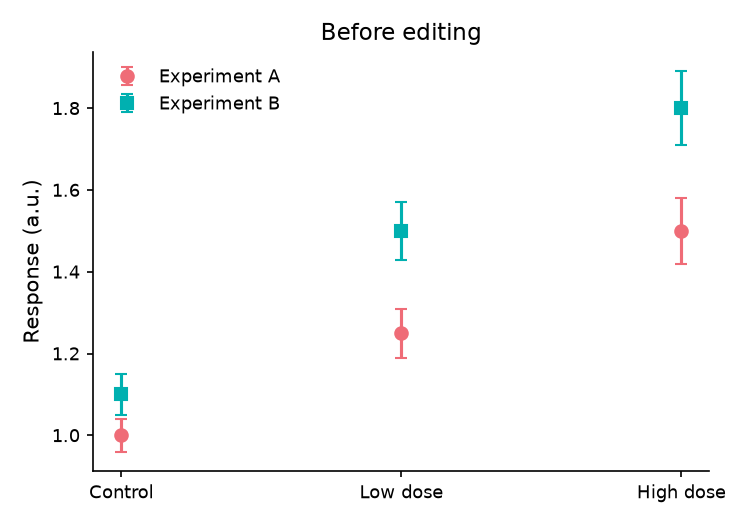
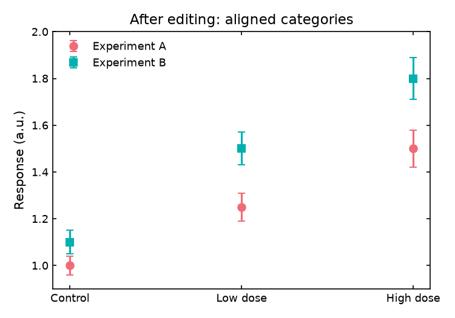
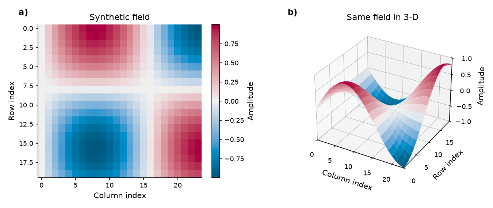
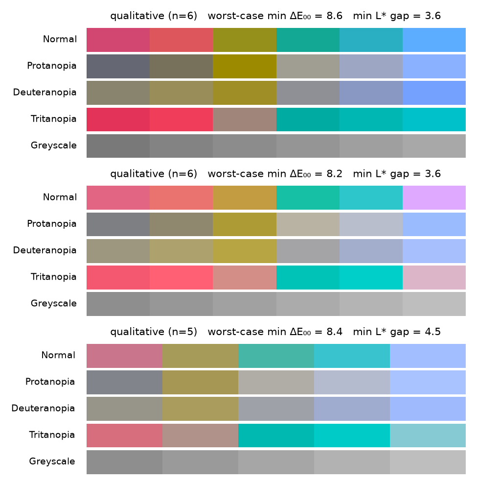
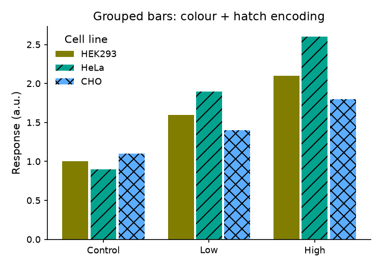
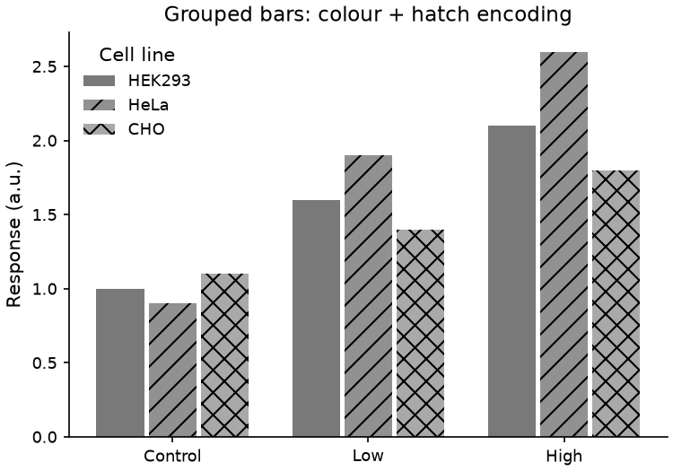

# Reproducible figure demos / 실행 가능한 figure 데모

These images are actual mudplot output from
[`scripts/render_docs_demo.py`](../scripts/render_docs_demo.py), not mockups.
All data are **synthetic** (NumPy seed `2026`), not experimental results.

아래 이미지는 pandas DataFrame을 mudplot에 직접 전달해 생성했습니다.
모든 데이터는 **합성 데이터**이며 실제 실험 결과나 통계적 유의성을 나타내지 않습니다.

## Run / 재생성

From the repository root, using the environment where mudplot is installed:

```bash
python -m pip install -e '.[dev]' pandas
python -m scripts.render_docs_demo
python -m pytest -q
```

이 저장소의 가상환경을 사용한다면 `python` 대신 `.venv/bin/python`을 사용하세요.
데모 실행은 `docs/images/`의 PNG, PDF, `.mplot.json`을 재생성합니다.
pandas는 이 데모의 입력 의존성이며 라이브러리 필수 의존성에는 추가하지 않았습니다.

## 1. pandas → four-panel figure


- **a:** Grouped response curves use colour, marker and dash encoding.
- **b:** Three groups share one continuous temperature normalization (20–48)
  and one colorbar. Markers identify the same groups as panel a.
- **c/d:** Violin and KDE describe values across the sampled times, **not**
  independent experimental replicates or confidence intervals.

그룹별 곡선, 연속값 색상 매핑, violin, KDE를 한 figure로 렌더링합니다.
스크립트는 DataFrame 값과 실제 선 좌표의 일치, 공통 normalization,
colorbar 개수, 저장 이미지 크기까지 assert로 확인합니다.

[Vector PDF](images/pandas_demo.pdf) · [Editable spec](images/pandas_demo.mplot.json)

Minimal DataFrame example (the full gallery code is in the script above):

```python
import matplotlib.pyplot as plt
import mudplot as mp
import pandas as pd

frame = pd.DataFrame({
    "time": [0, 1, 2, 0, 1, 2],
    "response": [0.2, 0.5, 0.7, 0.3, 0.8, 1.1],
    "condition": ["Control"] * 3 + ["Treatment"] * 3,
})
p = (mp.plot(frame)
     .line("time", "response", group="condition")
     .labels(x="Time (h)", y="Response (a.u.)")
     .size(5, 3.5))
plt.close(p.save("response.pdf"))
```

## 2. Edit → undo/redo → save/load

| Before editing / 수정 전 | After editing / 수정 후 |
|---|---|
|  |  |

Experiment A lists `Control, Low dose, High dose`; B deliberately lists
`High dose, Control, Low dose`. Both use the **same category positions**.
The illustrative error magnitudes are supplied explicitly, not estimated by
mudplot. Only theme, title, legend and axis limits change between these images.

범주 순서가 다른 두 데이터 열도 같은 범주 위치에 표시됩니다.
오차 크기도 합성 값이며 라이브러리가 신뢰구간을 계산한 것은 아닙니다.
수정 전후 데이터는 동일하고 스타일과 축 범위만 바뀝니다.

```python
p.theme("boxed").labels(title="After editing: aligned categories")
p.legend(location="upper left").ylim(0.9, 2.0)
edited = p.to_json()
p.labels(title="Temporary edit")
p.store.undo()
assert p.to_json() == edited
p.store.redo()
assert p.spec.panels[0].title == "Temporary edit"
p.store.undo()
restored = mp.Plot.from_json(p.to_json())
assert restored.spec.to_dict() == p.spec.to_dict()
```

[Before PDF](images/editing_before.pdf) · [After PDF](images/editing_after.pdf) ·
[Edited spec](images/editing_after.mplot.json)

## 3. Matrix → heatmap + 3-D surface



Both panels use the same `sin(column / 5) * cos(row / 5)` matrix.
Axes show matrix indices, not calibrated physical coordinates. The heatmap
uses image convention (row zero at the top). The script checks 3-D limits and
the `b)` panel label as well as successful rendering.

같은 행렬을 heatmap과 3D surface로 보여줍니다. 축은 물리 단위가 아닌
행렬 인덱스이며 heatmap은 위쪽이 0행인 이미지 좌표계입니다.

[Vector PDF](images/fields_demo.pdf) · [Editable spec](images/fields_demo.mplot.json)

## 4. Colour palette presets: measured, not assumed



Each row set is real `Palette.report()` output, not a marketing claim.
`paper` and `vivid` are measured safe (worst-case ΔE00 ≥ 8 across normal +
protanopia/deuteranopia simulation, min CIE L* gap ≥ 3 in true greyscale)
for up to **6** categories; `soft` (lower chroma, for large-area fills) for
up to **5**. Beyond those counts more colours are still generated but not
verified safe — see `tests/test_palette_presets.py` and
`mudplot.capabilities()["palette_presets"]` for the exact numbers.

이름이 붙은 세 팔레트(`paper`/`vivid`/`soft`)를 일반 시각·적색맹·녹색맹·
진짜 흑백으로 미리 보여줍니다. 안전성은 주장이 아니라 `Palette.report()`로 직접
측정한 값이며, 검증된 카테고리 수를 넘으면 보장되지 않습니다.

```python
import mudplot as mp

pal = mp.color_palette(6, preset="paper")
print(pal.report())
p = mp.plot(data).line("x", "y", group="g").palette(preset="paper")
```

## 5. Grouped bar chart: readable after black & white printing

| Colour print / 컬러 인쇄 | Simulated B&W print / 흑백 인쇄 시뮬레이션 |
|---|---|
|  |  |

The right image is **not** a mockup of what greyscale might look like — it is
the left PNG converted pixel-by-pixel to true relative luminance (the same
sRGB → linear → luminance formula `Palette.grayscale_srgb()` uses), matching
flat black & white print or a photocopier. `.bar(..., group=...)` cycles a
hatch pattern per group (`ThemeSpec.hatches`, on by default whenever
`redundant_encoding=True`), so groups stay distinguishable even where the
colours themselves compress to similar greys — see
`tests/test_palette_presets.py` for the hatch-uniqueness checks and
`scripts/render_docs_demo.py:simulate_bw_print` for the conversion code.

오른쪽 이미지는 왼쪽 PNG를 실제 휘도 계산으로 변환한 결과입니다(가상이나
추측이 아님). 색상이 비슷해져도 막대별 해칭 패턴이 달라 흑백 인쇄에서도
그룹이 구별됩니다.

[Vector PDF](images/bar_hatched.pdf) · [Editable spec](images/bar_hatched.mplot.json)

## What is checked / 검증 범위

- `validate()` and lossless JSON round-trips for all exported figures.
- Actual PNG dimensions: `1350×975`, `750×525` (before/after), `1350×570`,
  `750×525` (bar chart).
- Successful PDF export; open figures are closed after use.
- pandas numeric data reach the rendered line without alteration.
- Shared scatter normalization, reordered category positions, undo/redo,
  3-D limits and panel labels.
- Each named palette preset is measured `cvd_safe` and `grayscale_safe` up to
  its documented category count; a grouped bar chart keeps 3 distinct hatch
  patterns, verified both before and after true-greyscale conversion.

검증 환경: pandas **3.0.5**, Matplotlib **3.11.1**.
전체 테스트 **322개 통과**, 건너뛴 테스트 없음. Ruff 검사도 통과했습니다.
PNG를 직접 열어 패널 배치, 축·범례·colorbar의 잘림과 겹침도 확인했습니다.
이는 이 환경과 데모에 대한 확인이며, 모든 pandas dtype이나 저널 규정에 대한
검증을 의미하지 않습니다. 논문 제출용 크기·폰트·단위는 별도로 확인하세요.

Browser/README image scaling is not a physical-size preview. `save()` preserves
the configured inch dimensions; use the PDF for final placement in a paper.
