# Plot gallery / 플롯 갤러리

_Generated from `examples/plots/`; do not edit by hand._

Every image below is real mudplot output. The displayed Python is the exact
source executed to build it, using deterministic synthetic data. Each
editable spec passes validation and a lossless JSON round-trip.

아래 이미지는 모두 결정론적 합성 데이터로 생성한 실제 mudplot 출력입니다.
표시된 Python 코드를 그대로 실행해 이미지를 만들며, 모든 spec은 검증과
무손실 JSON round-trip을 통과합니다.

Append `plot.save("figure.png")` to any example to save it.
각 예제 끝에 `plot.save("figure.png")`를 추가하면 저장할 수 있습니다.
After use, close the returned Figure with `matplotlib.pyplot.close(fig)`.
사용 후 반환된 Figure를 `matplotlib.pyplot.close(fig)`로 닫아주세요.

Required/optional names below are `LayerSpec` fields, not builder aliases
(for example, `quiver(scale=...)` sets `quiver_scale`).
필수·선택 이름은 builder 별칭이 아닌 `LayerSpec` 필드입니다.
예를 들어 `quiver(scale=...)`는 `quiver_scale` 필드를 설정합니다.

## Series and relationships / 계열 및 관계

### `line` — Line

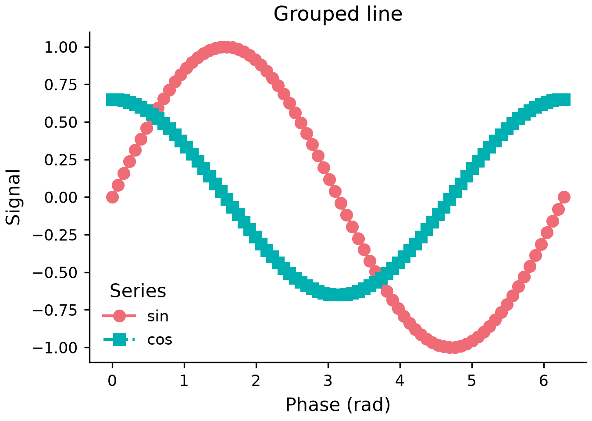

Grouped trajectories use colour, marker, and dash together.

그룹별 궤적을 색상·마커·선 모양으로 함께 구분합니다.

**Required / 필수:** `x`, `y`

**Optional / 선택:** `group`, `label`, `color`, `line_width`, `line_style`, `drawstyle`, `marker`, `marker_size`, `alpha`, `axis`

<details><summary>Runnable code / 실행 코드</summary>

```python
import mudplot as mp
import numpy as np

x = np.linspace(0, 2 * np.pi, 80)
data = {
    "x": np.tile(x, 2),
    "signal": np.r_[np.sin(x), 0.65 * np.cos(x)],
    "series": ["sin"] * len(x) + ["cos"] * len(x),
}
plot = (
    mp.plot(data)
    .line("x", "signal", group="series")
    .labels(x="Phase (rad)", y="Signal", title="Grouped line")
    .legend(title="Series")
    .size(4.5, 3.2)
)
plot.save("figure.png")
```

</details>

[Editable spec / 편집 가능한 spec](images/plots/line.mplot.json) · [Reference / 레퍼런스](REFERENCE.md#line)

### `regplot` — Regression

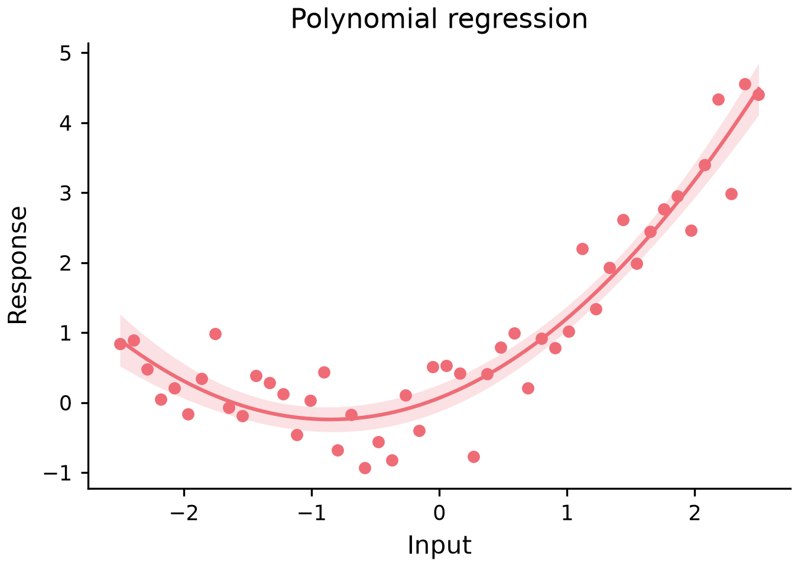

A polynomial mean fit with an explicit opt-in confidence band.

명시적으로 선택한 신뢰구간과 다항 평균 적합선을 표시합니다.

**Required / 필수:** `x`, `y`

**Optional / 선택:** `degree`, `confidence`, `group`, `label`, `color`, `line_width`, `line_style`, `marker`, `marker_size`, `alpha`, `axis`

<details><summary>Runnable code / 실행 코드</summary>

```python
import mudplot as mp
import numpy as np

rng = np.random.default_rng(7)
x = np.linspace(-2.5, 2.5, 48)
data = {"x": x, "y": 0.4 + 0.7 * x + 0.35 * x**2 + rng.normal(0, 0.55, len(x))}
plot = (
    mp.plot(data)
    .regplot("x", "y", degree=2, confidence=95, marker_size=4)
    .labels(x="Input", y="Response", title="Polynomial regression")
    .size(4.5, 3.2)
)
plot.save("figure.png")
```

</details>

[Editable spec / 편집 가능한 spec](images/plots/regplot.mplot.json) · [Reference / 레퍼런스](REFERENCE.md#regplot)

### `scatter` — Scatter

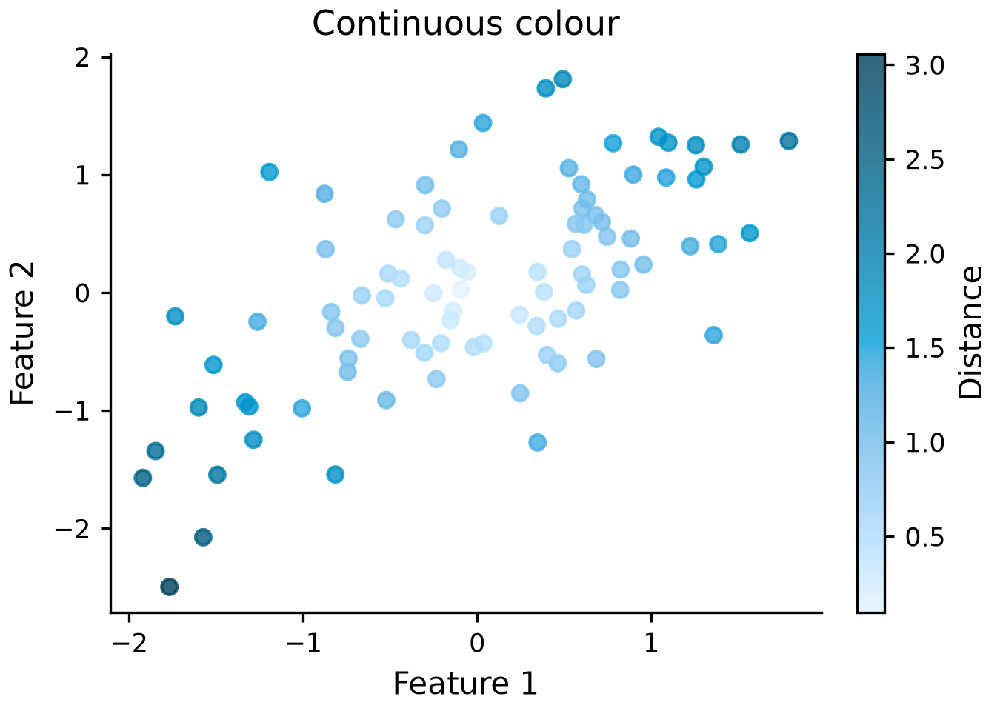

Point colour shares one continuous normalization and colorbar.

점 색상에 공통 연속 정규화와 colorbar를 적용합니다.

**Required / 필수:** `x`, `y`

**Optional / 선택:** `group`, `label`, `color`, `marker`, `marker_size`, `alpha`, `c`, `cmap_kind`, `colorbar`, `clabel`, `axis`

<details><summary>Runnable code / 실행 코드</summary>

```python
import mudplot as mp
import numpy as np

rng = np.random.default_rng(11)
x = rng.normal(size=90)
y = 0.65 * x + rng.normal(scale=0.7, size=len(x))
data = {"x": x, "y": y, "score": np.hypot(x, y)}
plot = (
    mp.plot(data)
    .scatter(
        "x", "y", c="score", colorbar=True, clabel="Distance", marker_size=5, alpha=0.8
    )
    .labels(x="Feature 1", y="Feature 2", title="Continuous colour")
    .size(4.5, 3.2)
)
plot.save("figure.png")
```

</details>

[Editable spec / 편집 가능한 spec](images/plots/scatter.mplot.json) · [Reference / 레퍼런스](REFERENCE.md#scatter)

### `stripplot` — Strip plot

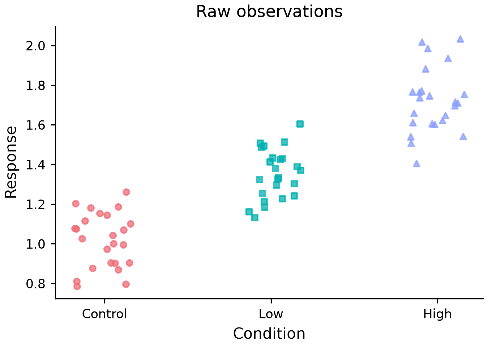

Deterministic jitter reveals individual categorical observations.

결정론적 jitter로 범주별 개별 관측값을 보여줍니다.

**Required / 필수:** `x`, `y`

**Optional / 선택:** `jitter`, `group`, `label`, `color`, `marker`, `marker_size`, `alpha`, `axis`

<details><summary>Runnable code / 실행 코드</summary>

```python
import mudplot as mp
import numpy as np

rng = np.random.default_rng(21)
conditions = ["Control", "Low", "High"]
data = {
    "condition": np.repeat(conditions, 24),
    "value": np.concatenate(
        [
            rng.normal(1.0, 0.12, 24),
            rng.normal(1.35, 0.16, 24),
            rng.normal(1.75, 0.2, 24),
        ]
    ),
}
plot = (
    mp.plot(data)
    .stripplot(
        "condition", "value", group="condition", jitter=0.18, marker_size=4, alpha=0.75
    )
    .labels(x="Condition", y="Response", title="Raw observations")
    .legend(show=False)
    .size(4.5, 3.2)
)
plot.save("figure.png")
```

</details>

[Editable spec / 편집 가능한 spec](images/plots/stripplot.mplot.json) · [Reference / 레퍼런스](REFERENCE.md#stripplot)

### `stackplot` — Stack plot

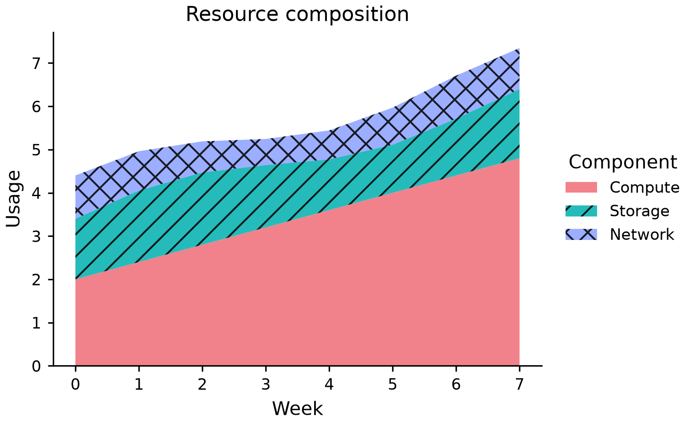

Aligned group series form a cumulative area chart.

정렬된 그룹 계열을 누적 영역으로 표현합니다.

**Required / 필수:** `x`, `y`, `group`

**Optional / 선택:** `color`, `line_width`, `line_style`, `alpha`, `axis`

<details><summary>Runnable code / 실행 코드</summary>

```python
import mudplot as mp
import numpy as np

x = np.arange(8)
data = {
    "x": np.tile(x, 3),
    "value": np.r_[2 + 0.4 * x, 1.4 + 0.3 * np.sin(x), 0.8 + 0.2 * np.cos(x)],
    "component": np.repeat(["Compute", "Storage", "Network"], len(x)),
}
plot = (
    mp.plot(data)
    .stackplot("x", "value", group="component", alpha=0.85)
    .labels(x="Week", y="Usage", title="Resource composition")
    .legend(title="Component", location="outside right")
    .size(5.2, 3.2)
)
plot.save("figure.png")
```

</details>

[Editable spec / 편집 가능한 spec](images/plots/stackplot.mplot.json) · [Reference / 레퍼런스](REFERENCE.md#stackplot)

### `quiver` — Quiver

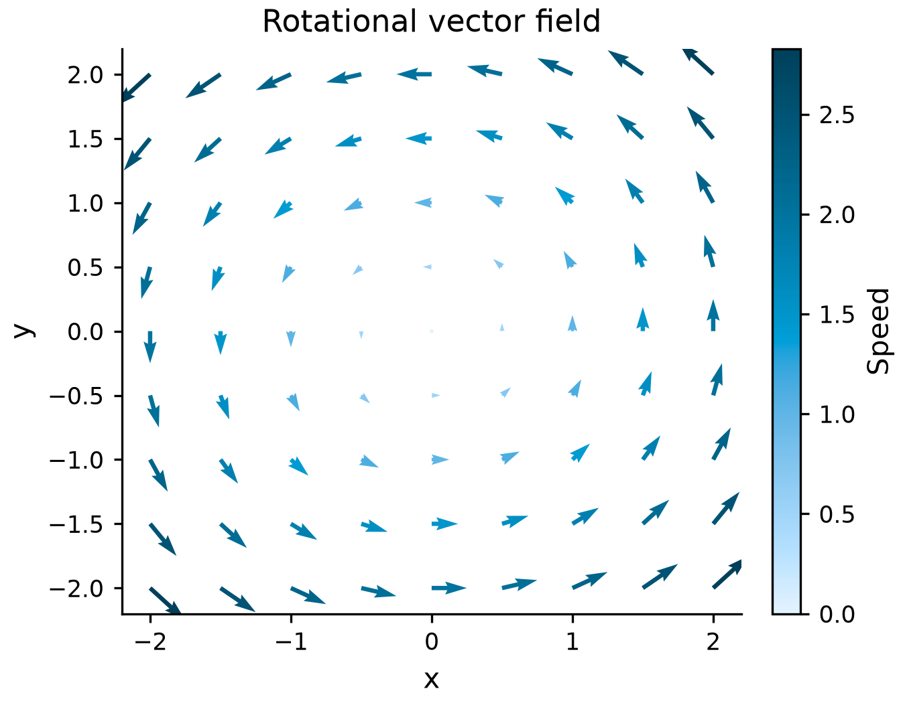

Vector direction and magnitude are encoded in data coordinates.

데이터 좌표계에서 벡터 방향과 크기를 표현합니다.

**Required / 필수:** `x`, `y`, `u`, `v`

**Optional / 선택:** `c`, `cmap_kind`, `colorbar`, `clabel`, `label`, `color`, `line_width`, `quiver_scale`, `quiver_width`, `alpha`, `axis`

<details><summary>Runnable code / 실행 코드</summary>

```python
import mudplot as mp
import numpy as np

x, y = np.meshgrid(np.linspace(-2, 2, 9), np.linspace(-2, 2, 9))
u, v = -y, x
data = {
    "x": x.ravel(),
    "y": y.ravel(),
    "u": u.ravel(),
    "v": v.ravel(),
    "speed": np.hypot(u, v).ravel(),
}
plot = (
    mp.plot(data)
    .quiver(
        "x",
        "y",
        "u",
        "v",
        c="speed",
        colorbar=True,
        clabel="Speed",
        scale=8,
        width=0.007,
    )
    .labels(x="x", y="y", title="Rotational vector field")
    .size(4.5, 3.5)
)
plot.save("figure.png")
```

</details>

[Editable spec / 편집 가능한 spec](images/plots/quiver.mplot.json) · [Reference / 레퍼런스](REFERENCE.md#quiver)

### `bar` — Bar

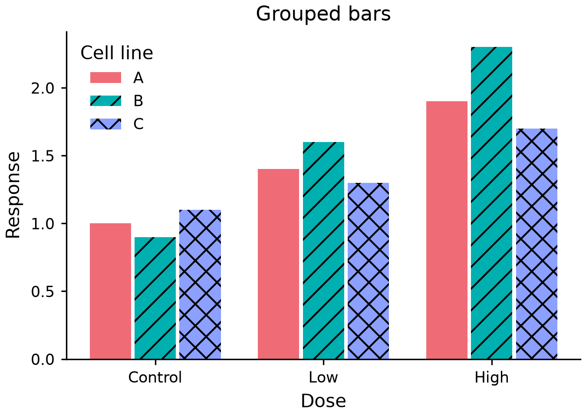

Grouped bars retain hatch differences in grayscale print.

그룹 막대는 흑백 인쇄에서도 해칭으로 구분됩니다.

**Required / 필수:** `x`, `y`

**Optional / 선택:** `group`, `label`, `color`, `alpha`, `axis`

<details><summary>Runnable code / 실행 코드</summary>

```python
import mudplot as mp

data = {
    "dose": ["Control", "Low", "High"] * 3,
    "response": [1.0, 1.4, 1.9, 0.9, 1.6, 2.3, 1.1, 1.3, 1.7],
    "cell": ["A"] * 3 + ["B"] * 3 + ["C"] * 3,
}
plot = (
    mp.plot(data)
    .bar("dose", "response", group="cell")
    .labels(x="Dose", y="Response", title="Grouped bars")
    .legend(title="Cell line")
    .size(4.5, 3.2)
)
plot.save("figure.png")
```

</details>

[Editable spec / 편집 가능한 spec](images/plots/bar.mplot.json) · [Reference / 레퍼런스](REFERENCE.md#bar)

### `errorbar` — Error bar

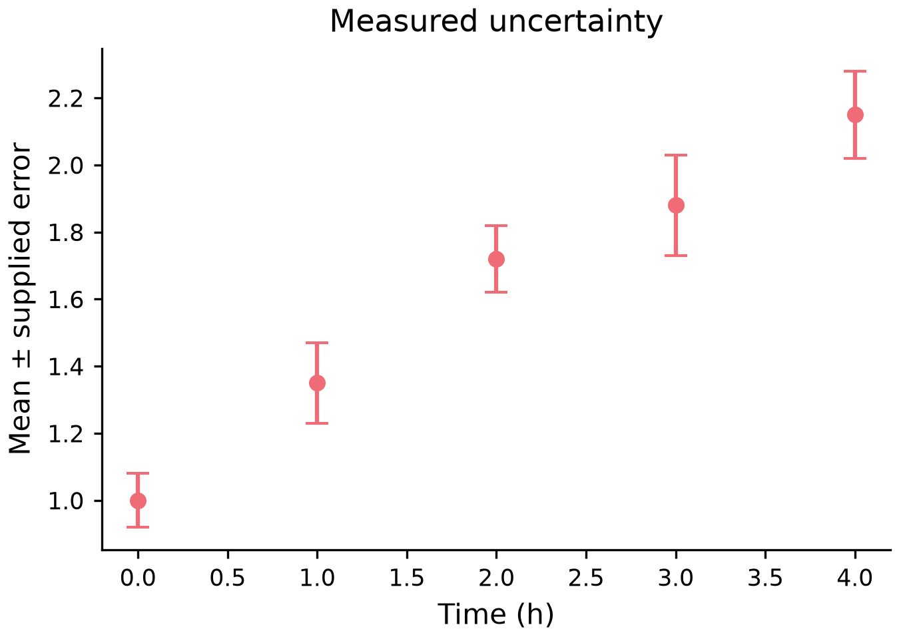

Caller-supplied x/y uncertainty is rendered without inference.

사용자가 제공한 x/y 불확실성을 별도 추정 없이 표시합니다.

**Required / 필수:** `x`, `y`

**Optional / 선택:** `yerr`, `xerr`, `group`, `label`, `color`, `capsize`, `marker`, `marker_size`, `line_width`, `alpha`, `axis`

<details><summary>Runnable code / 실행 코드</summary>

```python
import mudplot as mp

data = {
    "time": [0, 1, 2, 3, 4],
    "mean": [1.0, 1.35, 1.72, 1.88, 2.15],
    "error": [0.08, 0.12, 0.1, 0.15, 0.13],
}
plot = (
    mp.plot(data)
    .errorbar("time", "mean", yerr="error", capsize=4, marker="o", marker_size=5)
    .labels(x="Time (h)", y="Mean ± supplied error", title="Measured uncertainty")
    .size(4.5, 3.2)
)
plot.save("figure.png")
```

</details>

[Editable spec / 편집 가능한 spec](images/plots/errorbar.mplot.json) · [Reference / 레퍼런스](REFERENCE.md#errorbar)

### `band` — Band

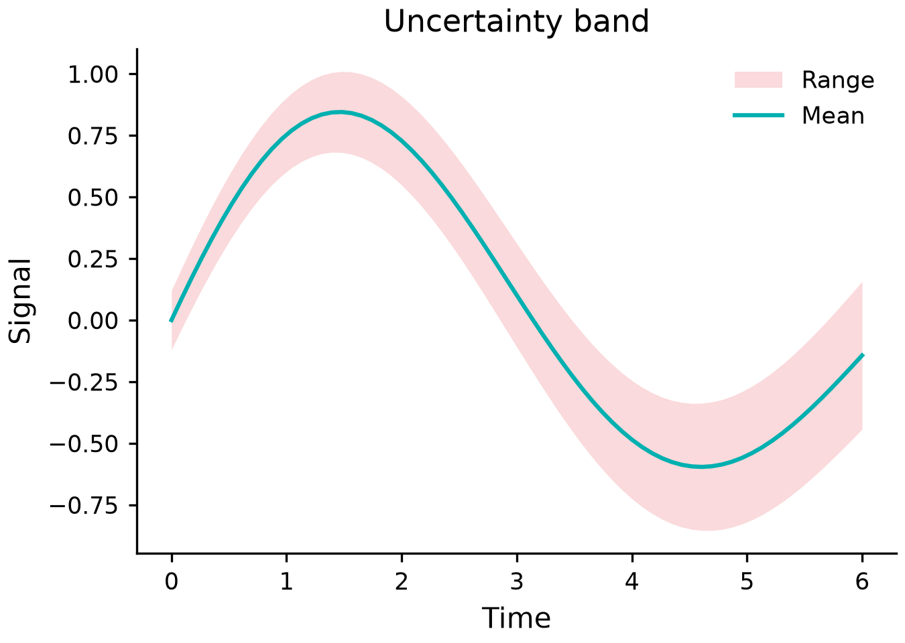

A shaded lower/upper envelope accompanies the central trajectory.

중심 궤적과 하한·상한 음영 영역을 함께 표시합니다.

**Required / 필수:** `x`, `y`, `y2`

**Optional / 선택:** `group`, `label`, `color`, `alpha`, `axis`

<details><summary>Runnable code / 실행 코드</summary>

```python
import mudplot as mp
import numpy as np

x = np.linspace(0, 6, 70)
mean = np.sin(x) * np.exp(-x / 9)
spread = 0.12 + 0.03 * x
data = {"x": x, "mean": mean, "lower": mean - spread, "upper": mean + spread}
plot = (
    mp.plot(data)
    .band("x", "lower", "upper", label="Range", alpha=0.25)
    .line("x", "mean", label="Mean")
    .labels(x="Time", y="Signal", title="Uncertainty band")
    .legend()
    .size(4.5, 3.2)
)
plot.save("figure.png")
```

</details>

[Editable spec / 편집 가능한 spec](images/plots/band.mplot.json) · [Reference / 레퍼런스](REFERENCE.md#band)

## Distributions / 분포

### `hist` — Histogram

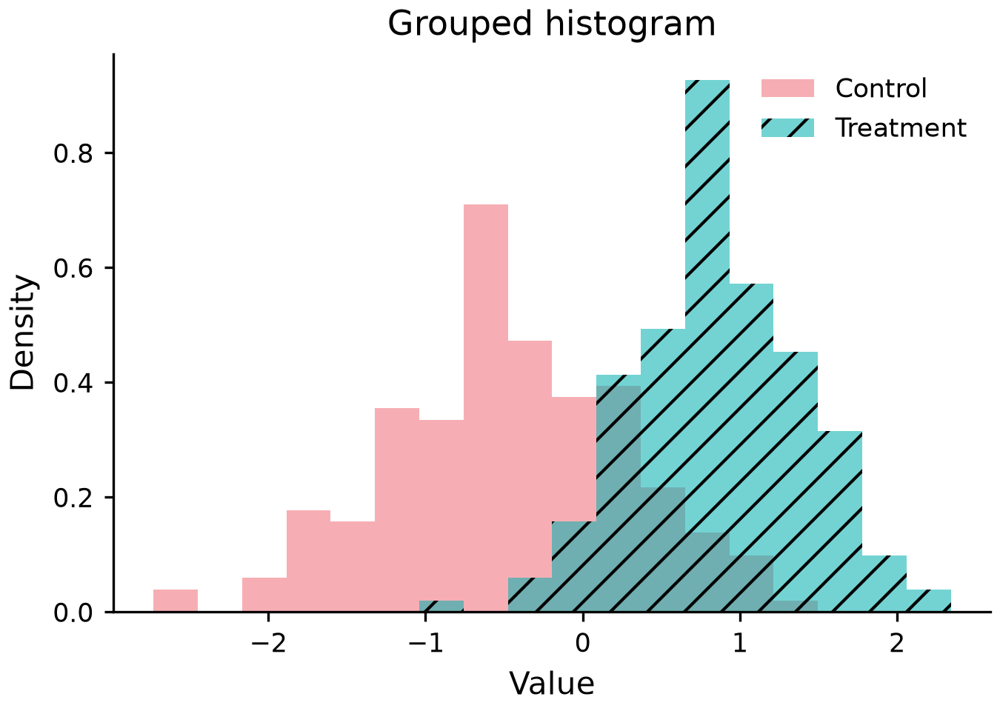

Grouped samples share bins for direct distribution comparison.

그룹 표본이 같은 bin을 사용해 분포를 직접 비교합니다.

**Required / 필수:** `x`

**Optional / 선택:** `bins`, `density`, `group`, `label`, `color`, `alpha`

<details><summary>Runnable code / 실행 코드</summary>

```python
import mudplot as mp
import numpy as np

rng = np.random.default_rng(4)
data = {
    "value": np.r_[rng.normal(-0.5, 0.75, 180), rng.normal(0.8, 0.55, 180)],
    "group": ["Control"] * 180 + ["Treatment"] * 180,
}
plot = (
    mp.plot(data)
    .hist(
        "value",
        bins=np.histogram_bin_edges(data["value"], bins=18).tolist(),
        density=True,
        group="group",
        alpha=0.55,
    )
    .labels(x="Value", y="Density", title="Grouped histogram")
    .legend()
    .size(4.5, 3.2)
)
plot.save("figure.png")
```

</details>

[Editable spec / 편집 가능한 spec](images/plots/hist.mplot.json) · [Reference / 레퍼런스](REFERENCE.md#hist)

### `box` — Box plot

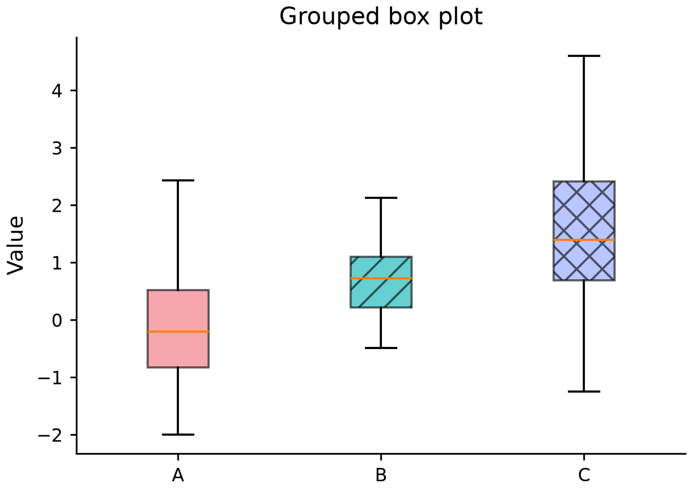

Compact summaries compare grouped medians and spread.

그룹별 중앙값과 산포를 간결하게 비교합니다.

**Required / 필수:** `x`

**Optional / 선택:** `group`, `label`, `color`, `alpha`

<details><summary>Runnable code / 실행 코드</summary>

```python
import mudplot as mp
import numpy as np

rng = np.random.default_rng(5)
data = {
    "value": np.r_[
        rng.normal(0, 1, 70), rng.normal(0.8, 0.7, 70), rng.normal(1.5, 1.15, 70)
    ],
    "group": np.repeat(["A", "B", "C"], 70),
}
plot = (
    mp.plot(data)
    .box("value", group="group")
    .labels(y="Value", title="Grouped box plot")
    .size(4.5, 3.2)
)
plot.save("figure.png")
```

</details>

[Editable spec / 편집 가능한 spec](images/plots/box.mplot.json) · [Reference / 레퍼런스](REFERENCE.md#box)

### `violin` — Violin

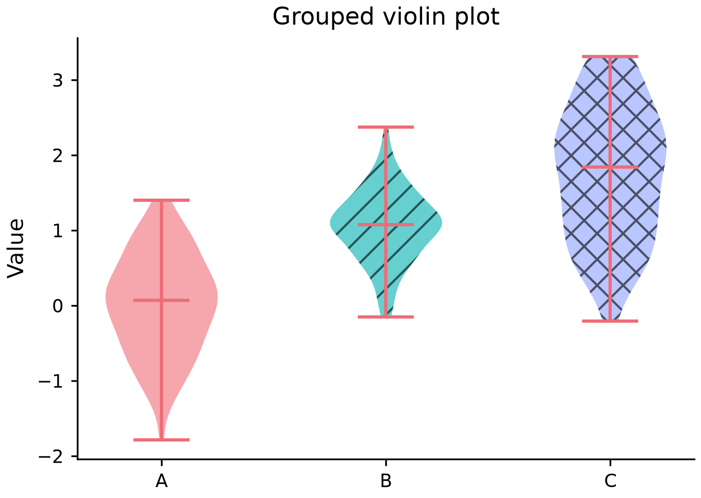

Mirrored density shapes retain categorical colour and hatch encoding.

대칭 밀도 모양에 범주별 색상과 해칭을 함께 적용합니다.

**Required / 필수:** `x`

**Optional / 선택:** `group`, `label`, `color`, `alpha`

<details><summary>Runnable code / 실행 코드</summary>

```python
import mudplot as mp
import numpy as np

rng = np.random.default_rng(6)
data = {
    "value": np.r_[
        rng.normal(0, 0.7, 100), rng.normal(1.0, 0.45, 100), rng.normal(1.8, 0.9, 100)
    ],
    "group": np.repeat(["A", "B", "C"], 100),
}
plot = (
    mp.plot(data)
    .violin("value", group="group")
    .labels(y="Value", title="Grouped violin plot")
    .size(4.5, 3.2)
)
plot.save("figure.png")
```

</details>

[Editable spec / 편집 가능한 spec](images/plots/violin.mplot.json) · [Reference / 레퍼런스](REFERENCE.md#violin)

### `kde` — Kernel density

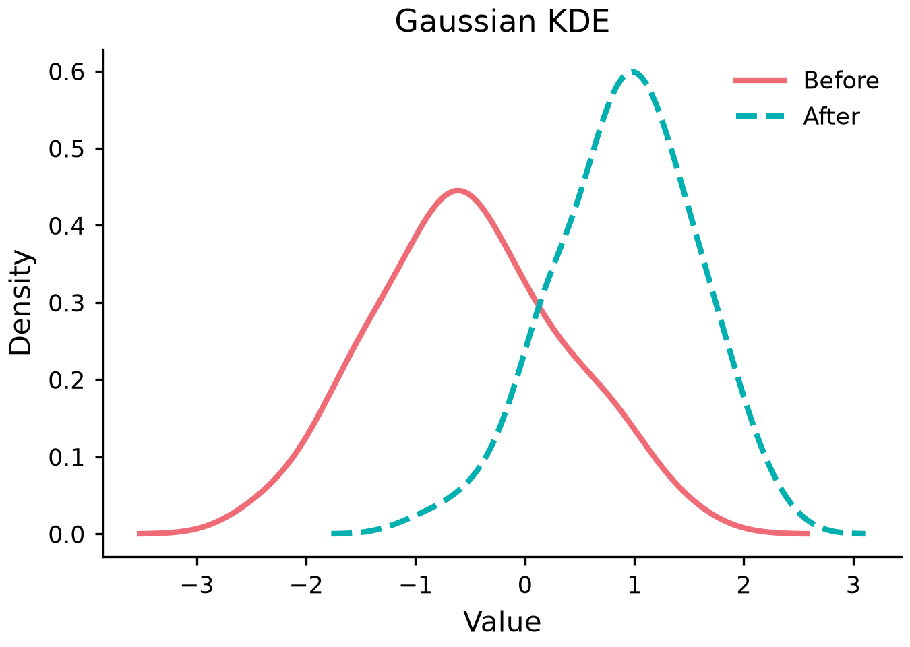

A NumPy-only Gaussian KDE compares smooth grouped distributions.

NumPy 기반 Gaussian KDE로 그룹별 분포를 부드럽게 비교합니다.

**Required / 필수:** `x`

**Optional / 선택:** `group`, `label`, `color`, `alpha`, `line_width`, `line_style`

<details><summary>Runnable code / 실행 코드</summary>

```python
import mudplot as mp
import numpy as np

rng = np.random.default_rng(8)
data = {
    "value": np.r_[rng.normal(-0.5, 0.8, 120), rng.normal(0.9, 0.6, 120)],
    "group": ["Before"] * 120 + ["After"] * 120,
}
plot = (
    mp.plot(data)
    .kde("value", group="group", line_width=2)
    .labels(x="Value", y="Density", title="Gaussian KDE")
    .legend()
    .size(4.5, 3.2)
)
plot.save("figure.png")
```

</details>

[Editable spec / 편집 가능한 spec](images/plots/kde.mplot.json) · [Reference / 레퍼런스](REFERENCE.md#kde)

### `rug` — Rug

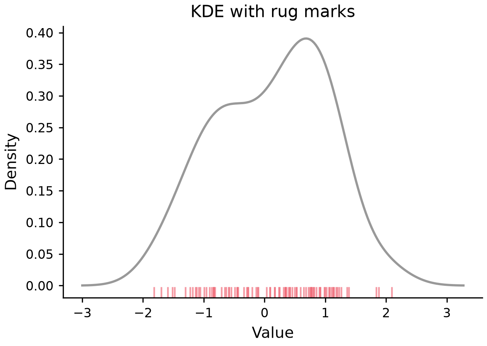

Rug marks expose observations underneath a density estimate.

밀도 추정 아래에 rug 표시로 개별 관측값을 드러냅니다.

**Required / 필수:** `x`

**Optional / 선택:** `group`, `label`, `color`, `alpha`, `line_width`, `line_style`

<details><summary>Runnable code / 실행 코드</summary>

```python
import mudplot as mp
import numpy as np

rng = np.random.default_rng(9)
values = np.r_[rng.normal(-0.6, 0.6, 45), rng.normal(0.9, 0.5, 45)]
data = {"value": values}
plot = (
    mp.plot(data)
    .kde("value", color="#777777", alpha=0.75)
    .rug("value", color="#ef6674", line_width=1.1, alpha=0.65)
    .labels(x="Value", y="Density", title="KDE with rug marks")
    .size(4.5, 3.2)
)
plot.save("figure.png")
```

</details>

[Editable spec / 편집 가능한 spec](images/plots/rug.mplot.json) · [Reference / 레퍼런스](REFERENCE.md#rug)

## Bivariate and matrix fields / 이변량 및 행렬 필드

### `hist2d` — 2-D histogram

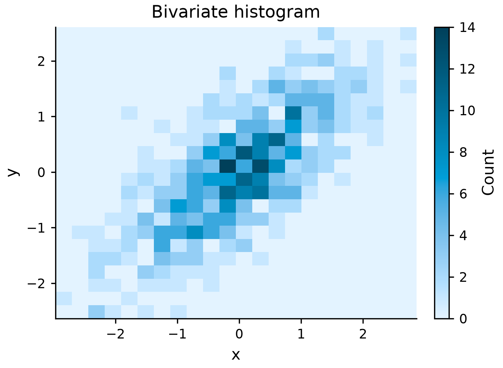

Rectangular bins show observation counts across two variables.

직사각형 bin으로 두 변수의 관측 빈도를 표시합니다.

**Required / 필수:** `x`, `y`

**Optional / 선택:** `bins`, `density`, `cmap_kind`, `colorbar`, `clabel`, `alpha`, `axis`

<details><summary>Runnable code / 실행 코드</summary>

```python
import mudplot as mp
import numpy as np

rng = np.random.default_rng(12)
x = rng.normal(size=600)
data = {"x": x, "y": 0.7 * x + rng.normal(scale=0.65, size=len(x))}
plot = (
    mp.plot(data)
    .hist2d("x", "y", bins=22, colorbar=True, clabel="Count")
    .labels(x="x", y="y", title="Bivariate histogram")
    .size(4.5, 3.3)
)
plot.save("figure.png")
```

</details>

[Editable spec / 편집 가능한 spec](images/plots/hist2d.mplot.json) · [Reference / 레퍼런스](REFERENCE.md#hist2d)

### `hexbin` — Hexbin

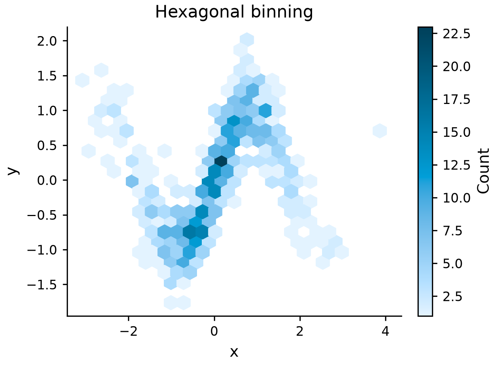

Hexagonal aggregation reveals dense bivariate structure.

육각형 집계로 밀집된 이변량 구조를 보여줍니다.

**Required / 필수:** `x`, `y`

**Optional / 선택:** `gridsize`, `mincnt`, `cmap_kind`, `colorbar`, `clabel`, `alpha`, `axis`

<details><summary>Runnable code / 실행 코드</summary>

```python
import mudplot as mp
import numpy as np

rng = np.random.default_rng(13)
x = rng.normal(size=700)
data = {"x": x, "y": np.sin(x * 1.8) + rng.normal(scale=0.35, size=len(x))}
plot = (
    mp.plot(data)
    .hexbin("x", "y", gridsize=24, mincnt=1, colorbar=True, clabel="Count")
    .labels(x="x", y="y", title="Hexagonal binning")
    .size(4.5, 3.3)
)
plot.save("figure.png")
```

</details>

[Editable spec / 편집 가능한 spec](images/plots/hexbin.mplot.json) · [Reference / 레퍼런스](REFERENCE.md#hexbin)

### `heatmap` — Heatmap

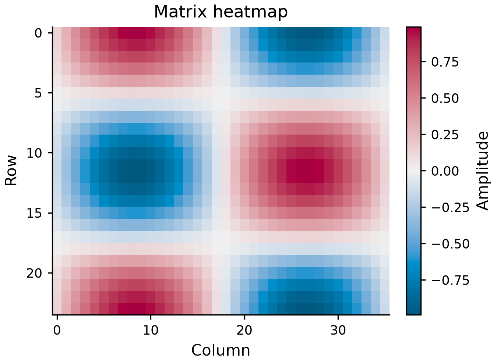

A diverging LCH colormap represents a signed matrix field.

발산형 LCH colormap으로 부호가 있는 행렬 필드를 표현합니다.

**Required / 필수:** `matrix`

**Optional / 선택:** `cmap_kind`, `colorbar`, `clabel`, `alpha`

<details><summary>Runnable code / 실행 코드</summary>

```python
import mudplot as mp
import numpy as np

x, y = np.meshgrid(np.linspace(-3, 3, 36), np.linspace(-2, 2, 24))
field = np.sin(x) * np.cos(1.5 * y)
plot = (
    mp.plot()
    .matrix("field", field)
    .heatmap("field", cmap_kind="diverging", clabel="Amplitude")
    .labels(x="Column", y="Row", title="Matrix heatmap")
    .size(4.5, 3.3)
)
plot.save("figure.png")
```

</details>

[Editable spec / 편집 가능한 spec](images/plots/heatmap.mplot.json) · [Reference / 레퍼런스](REFERENCE.md#heatmap)

### `contour` — Contour

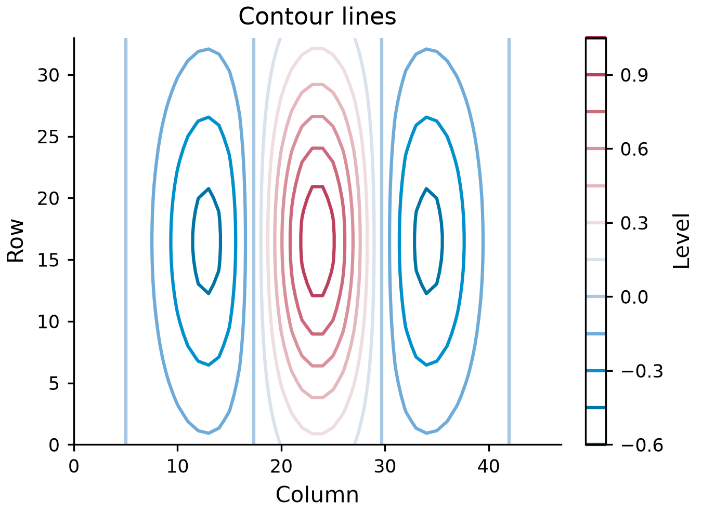

Level curves trace equal values across a matrix field.

등고선으로 행렬 필드의 같은 값을 연결합니다.

**Required / 필수:** `matrix`

**Optional / 선택:** `cmap_kind`, `colorbar`, `clabel`, `alpha`, `levels`

<details><summary>Runnable code / 실행 코드</summary>

```python
import mudplot as mp
import numpy as np

x, y = np.meshgrid(np.linspace(-3, 3, 48), np.linspace(-2, 2, 34))
field = np.exp(-(x**2 + y**2) / 3) * np.cos(2 * x)
plot = (
    mp.plot()
    .matrix("field", field)
    .contour("field", levels=9, cmap_kind="diverging", clabel="Level")
    .labels(x="Column", y="Row", title="Contour lines")
    .size(4.5, 3.3)
)
plot.save("figure.png")
```

</details>

[Editable spec / 편집 가능한 spec](images/plots/contour.mplot.json) · [Reference / 레퍼런스](REFERENCE.md#contour)

### `contourf` — Filled contour

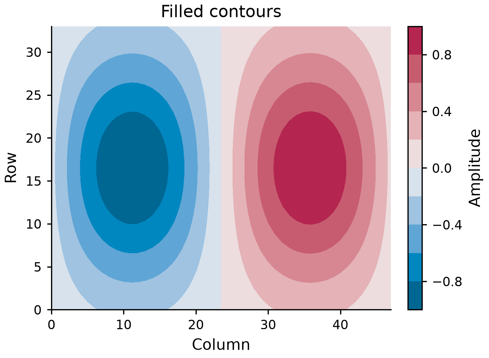

Filled level regions combine contour structure with continuous colour.

채운 등고 영역으로 구조와 연속 색상을 함께 보여줍니다.

**Required / 필수:** `matrix`

**Optional / 선택:** `cmap_kind`, `colorbar`, `clabel`, `alpha`, `levels`

<details><summary>Runnable code / 실행 코드</summary>

```python
import mudplot as mp
import numpy as np

x, y = np.meshgrid(np.linspace(-3, 3, 48), np.linspace(-2, 2, 34))
field = np.sin(x) * np.exp(-0.35 * y**2)
plot = (
    mp.plot()
    .matrix("field", field)
    .contourf("field", levels=12, cmap_kind="diverging", clabel="Amplitude")
    .labels(x="Column", y="Row", title="Filled contours")
    .size(4.5, 3.3)
)
plot.save("figure.png")
```

</details>

[Editable spec / 편집 가능한 spec](images/plots/contourf.mplot.json) · [Reference / 레퍼런스](REFERENCE.md#contourf)

## Reference marks and annotations / 기준선 및 주석

### `hline` — Horizontal reference line

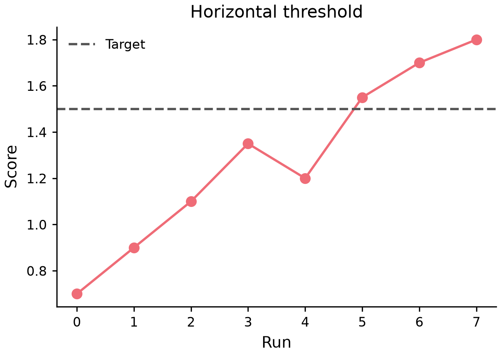

A labelled threshold is layered over the measured series.

측정 계열 위에 라벨이 있는 수평 임계선을 겹칩니다.

**Required / 필수:** `value`

**Optional / 선택:** `label`, `color`, `line_style`, `line_width`, `alpha`, `axis`

<details><summary>Runnable code / 실행 코드</summary>

```python
import mudplot as mp
import numpy as np

x = np.arange(8)
data = {"x": x, "y": [0.7, 0.9, 1.1, 1.35, 1.2, 1.55, 1.7, 1.8]}
plot = (
    mp.plot(data)
    .line("x", "y", marker="o")
    .hline(1.5, label="Target", line_style="--", color="#555555")
    .labels(x="Run", y="Score", title="Horizontal threshold")
    .legend()
    .size(4.5, 3.2)
)
plot.save("figure.png")
```

</details>

[Editable spec / 편집 가능한 spec](images/plots/hline.mplot.json) · [Reference / 레퍼런스](REFERENCE.md#hline)

### `vline` — Vertical reference line

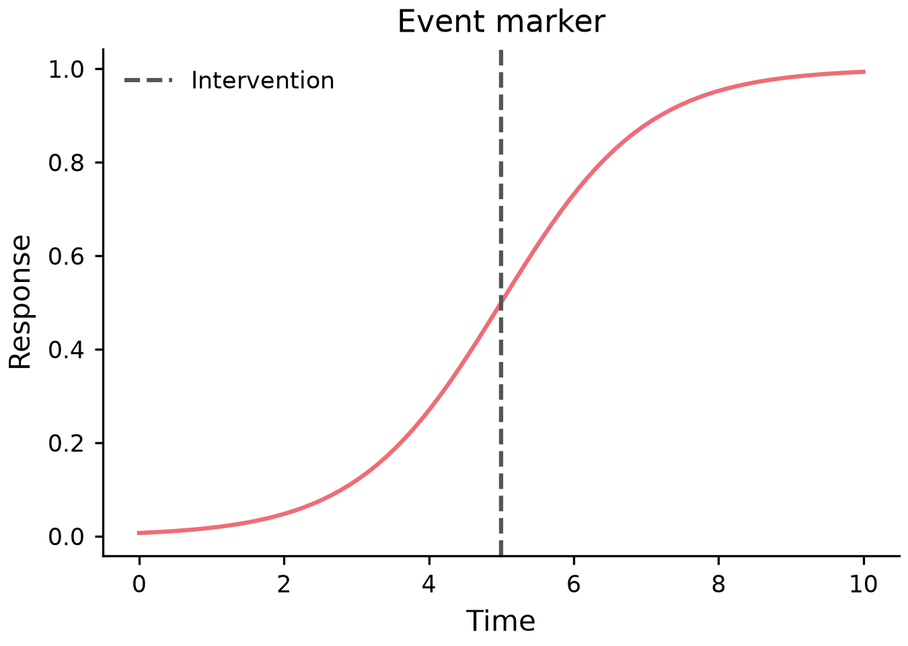

A vertical event marker identifies a transition in time.

수직 이벤트 표시로 시간상의 전환점을 나타냅니다.

**Required / 필수:** `value`

**Optional / 선택:** `label`, `color`, `line_style`, `line_width`, `alpha`, `axis`

<details><summary>Runnable code / 실행 코드</summary>

```python
import mudplot as mp
import numpy as np

x = np.linspace(0, 10, 80)
data = {"time": x, "signal": 1 / (1 + np.exp(-(x - 5)))}
plot = (
    mp.plot(data)
    .line("time", "signal")
    .vline(5, label="Intervention", line_style="--", color="#555555")
    .labels(x="Time", y="Response", title="Event marker")
    .legend()
    .size(4.5, 3.2)
)
plot.save("figure.png")
```

</details>

[Editable spec / 편집 가능한 spec](images/plots/vline.mplot.json) · [Reference / 레퍼런스](REFERENCE.md#vline)

### `text` — Text

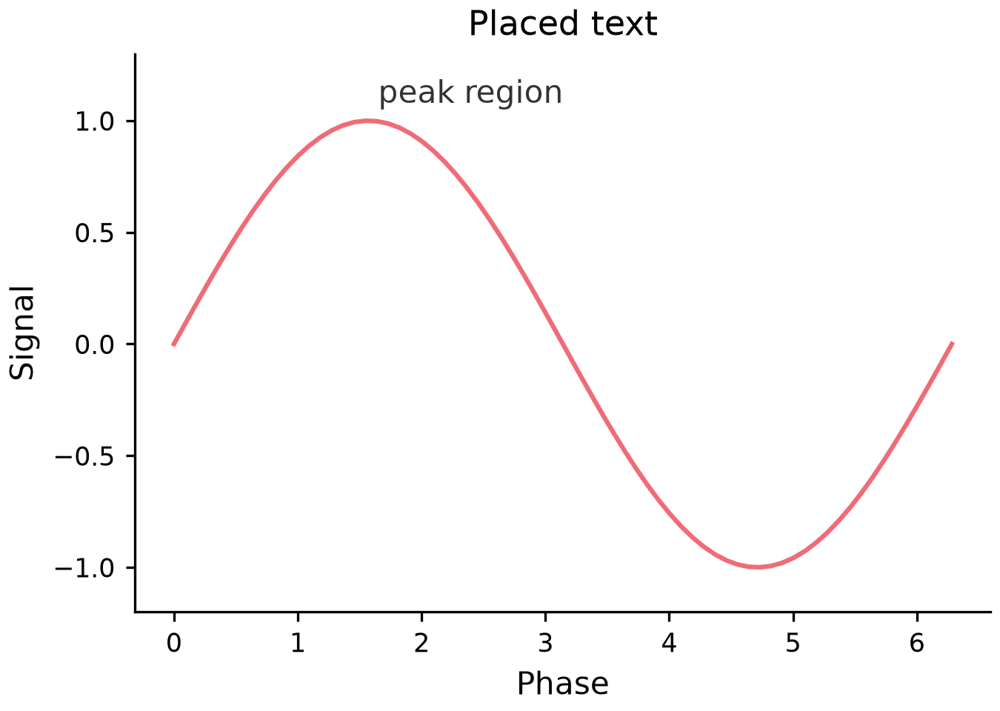

Free text is placed at an exact data-coordinate position.

자유 텍스트를 정확한 데이터 좌표에 배치합니다.

**Required / 필수:** `text`, `at`

**Optional / 선택:** `color`, `alpha`, `axis`

<details><summary>Runnable code / 실행 코드</summary>

```python
import mudplot as mp
import numpy as np

x = np.linspace(0, 2 * np.pi, 70)
data = {"x": x, "y": np.sin(x)}
plot = (
    mp.plot(data)
    .line("x", "y")
    .text("peak region", [1.65, 1.08], color="#333333")
    .labels(x="Phase", y="Signal", title="Placed text")
    .ylim(-1.2, 1.3)
    .size(4.5, 3.2)
)
plot.save("figure.png")
```

</details>

[Editable spec / 편집 가능한 spec](images/plots/text.mplot.json) · [Reference / 레퍼런스](REFERENCE.md#text)

### `annotate` — Annotation

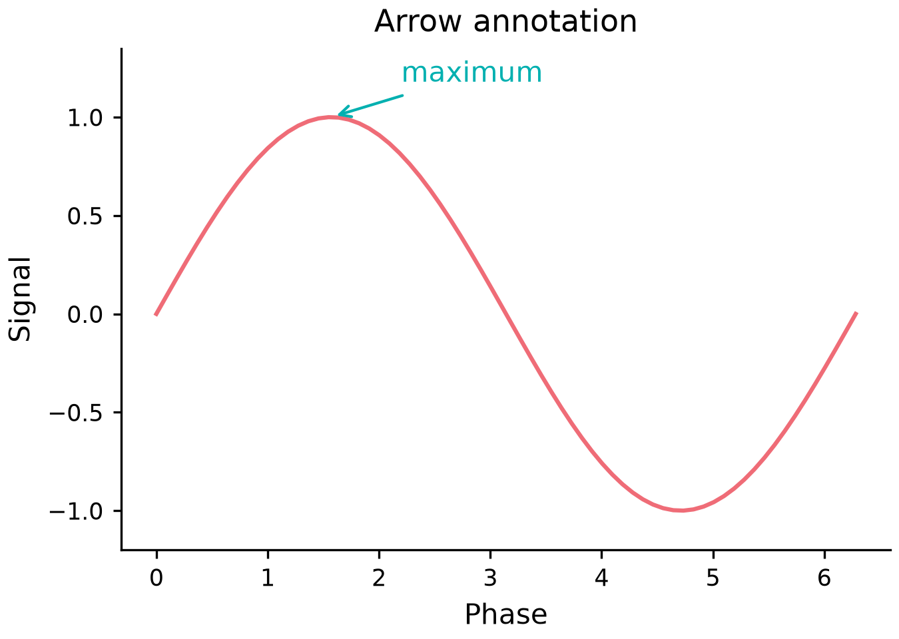

An arrow connects explanatory text to a selected observation.

화살표로 설명 텍스트와 선택한 관측값을 연결합니다.

**Required / 필수:** `text`, `at`

**Optional / 선택:** `to`, `color`, `alpha`, `axis`

<details><summary>Runnable code / 실행 코드</summary>

```python
import mudplot as mp
import numpy as np

x = np.linspace(0, 2 * np.pi, 70)
data = {"x": x, "y": np.sin(x)}
plot = (
    mp.plot(data)
    .line("x", "y")
    .annotate("maximum", [2.2, 1.18], to=[np.pi / 2, 1.0])
    .labels(x="Phase", y="Signal", title="Arrow annotation")
    .ylim(-1.2, 1.35)
    .size(4.5, 3.2)
)
plot.save("figure.png")
```

</details>

[Editable spec / 편집 가능한 spec](images/plots/annotate.mplot.json) · [Reference / 레퍼런스](REFERENCE.md#annotate)

## Part-to-whole / 구성 비율

### `pie` — Pie

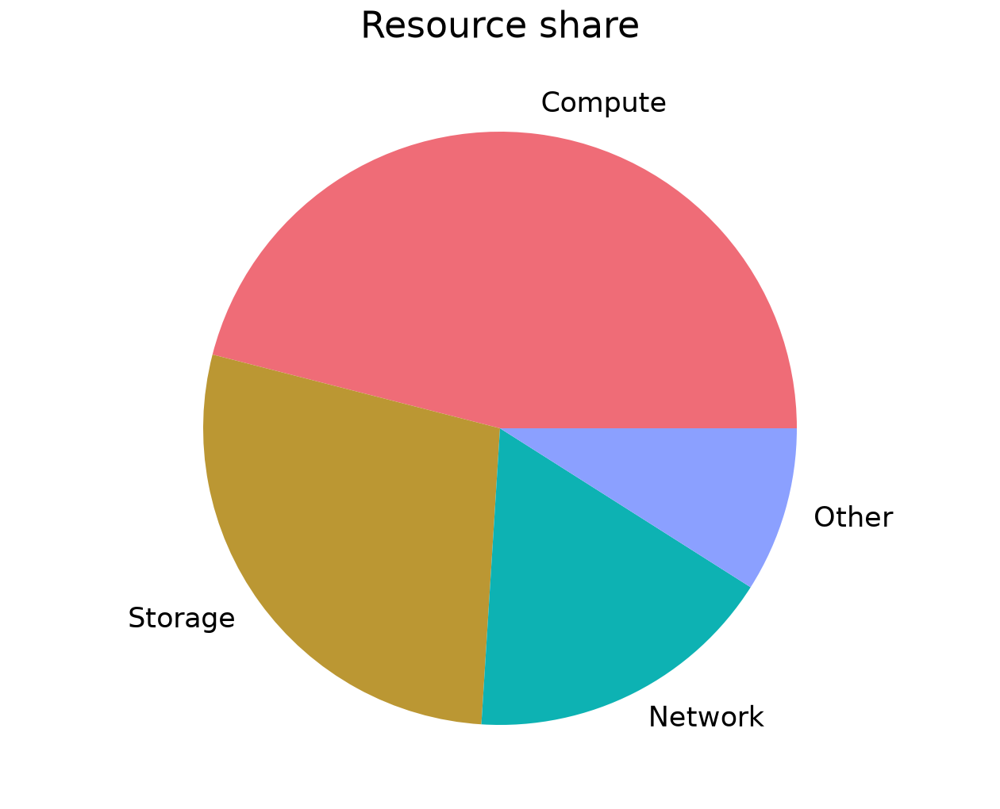

A small category set displays part-to-whole composition.

적은 수의 범주로 전체 대비 구성 비율을 보여줍니다.

**Required / 필수:** `x`, `y`

**Optional / 선택:** `color`, `alpha`

<details><summary>Runnable code / 실행 코드</summary>

```python
import mudplot as mp

data = {
    "component": ["Compute", "Storage", "Network", "Other"],
    "share": [46, 28, 17, 9],
}
plot = (
    mp.plot(data)
    .pie("component", "share")
    .labels(title="Resource share")
    .size(4.2, 3.4)
)
plot.save("figure.png")
```

</details>

[Editable spec / 편집 가능한 spec](images/plots/pie.mplot.json) · [Reference / 레퍼런스](REFERENCE.md#pie)

## Three-dimensional / 3차원

### `scatter3d` — 3-D scatter

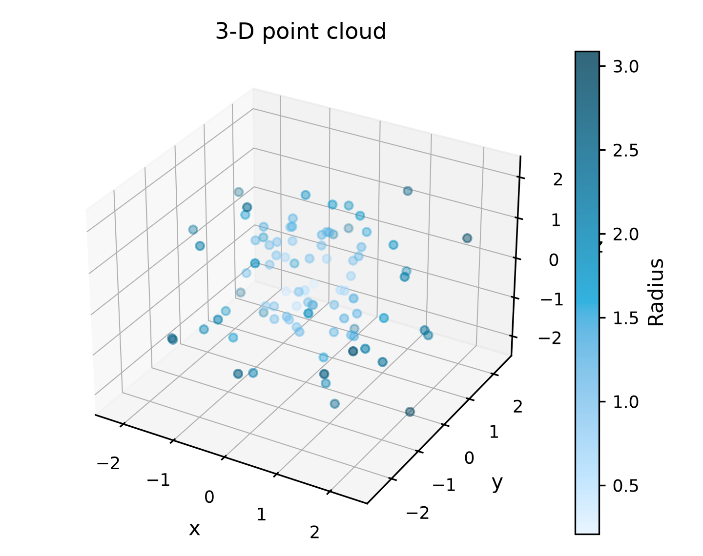

Three coordinates and continuous colour describe a point cloud.

세 좌표와 연속 색상으로 점 구름을 표현합니다.

**Required / 필수:** `x`, `y`, `z`

**Optional / 선택:** `group`, `label`, `color`, `marker`, `marker_size`, `alpha`, `c`, `cmap_kind`, `colorbar`, `clabel`

<details><summary>Runnable code / 실행 코드</summary>

```python
import mudplot as mp
import numpy as np

rng = np.random.default_rng(16)
xyz = rng.normal(size=(90, 3))
data = {
    "x": xyz[:, 0],
    "y": xyz[:, 1],
    "z": xyz[:, 2],
    "radius": np.linalg.norm(xyz, axis=1),
}
plot = (
    mp.plot(data)
    .projection3d()
    .scatter3d(
        "x",
        "y",
        "z",
        c="radius",
        colorbar=True,
        clabel="Radius",
        marker_size=4,
        alpha=0.8,
    )
    .labels(x="x", y="y", title="3-D point cloud")
    .zlabel("z")
    .size(4.8, 3.8)
)
plot.save("figure.png")
```

</details>

[Editable spec / 편집 가능한 spec](images/plots/scatter3d.mplot.json) · [Reference / 레퍼런스](REFERENCE.md#scatter3d)

### `line3d` — 3-D line

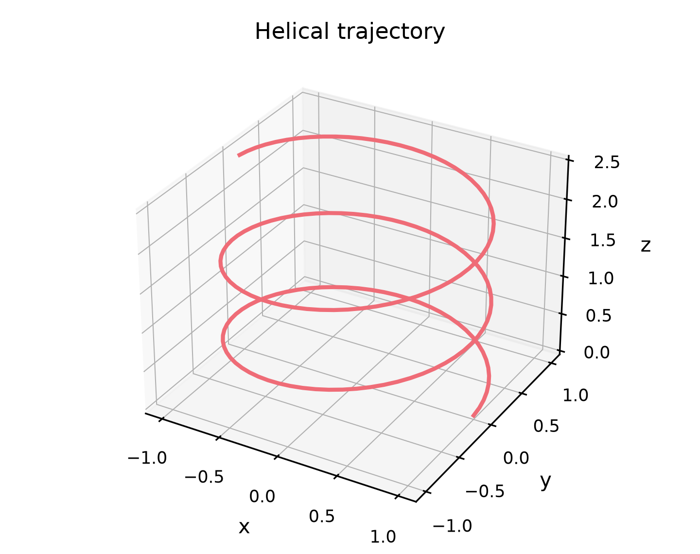

A parametric trajectory is drawn through three-dimensional space.

매개변수 궤적을 3차원 공간에 선으로 그립니다.

**Required / 필수:** `x`, `y`, `z`

**Optional / 선택:** `group`, `label`, `color`, `line_width`, `line_style`, `marker`, `alpha`

<details><summary>Runnable code / 실행 코드</summary>

```python
import mudplot as mp
import numpy as np

t = np.linspace(0, 5 * np.pi, 160)
data = {"x": np.cos(t), "y": np.sin(t), "z": t / (2 * np.pi)}
plot = (
    mp.plot(data)
    .projection3d()
    .line3d("x", "y", "z", line_width=2)
    .labels(x="x", y="y", title="Helical trajectory")
    .zlabel("z")
    .size(4.8, 3.8)
)
plot.save("figure.png")
```

</details>

[Editable spec / 편집 가능한 spec](images/plots/line3d.mplot.json) · [Reference / 레퍼런스](REFERENCE.md#line3d)

### `surface` — Surface

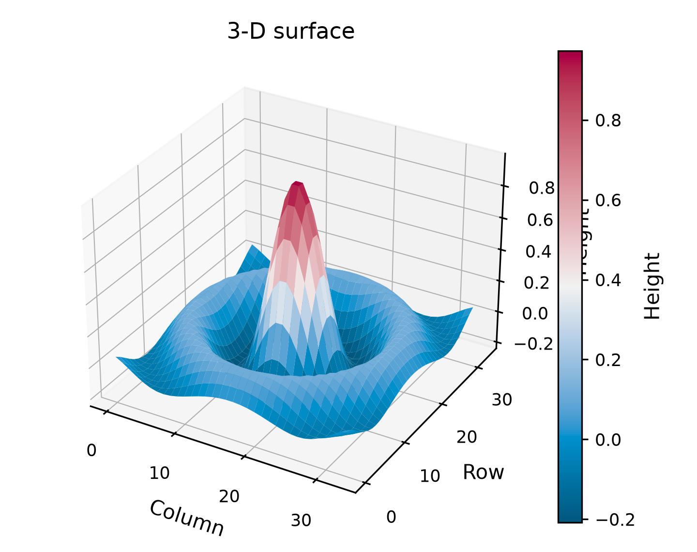

A matrix becomes a continuously coloured 3-D surface.

행렬을 연속 색상의 3차원 표면으로 변환합니다.

**Required / 필수:** `matrix`

**Optional / 선택:** `cmap_kind`, `colorbar`, `clabel`, `alpha`

<details><summary>Runnable code / 실행 코드</summary>

```python
import mudplot as mp
import numpy as np

x, y = np.meshgrid(np.linspace(-3, 3, 34), np.linspace(-3, 3, 34))
field = np.sinc(np.hypot(x, y))
plot = (
    mp.plot()
    .matrix("field", field)
    .projection3d()
    .surface("field", cmap_kind="diverging", clabel="Height")
    .labels(x="Column", y="Row", title="3-D surface")
    .zlabel("Height")
    .size(4.8, 3.8)
)
plot.save("figure.png")
```

</details>

[Editable spec / 편집 가능한 spec](images/plots/surface.mplot.json) · [Reference / 레퍼런스](REFERENCE.md#surface)

### `wireframe` — Wireframe

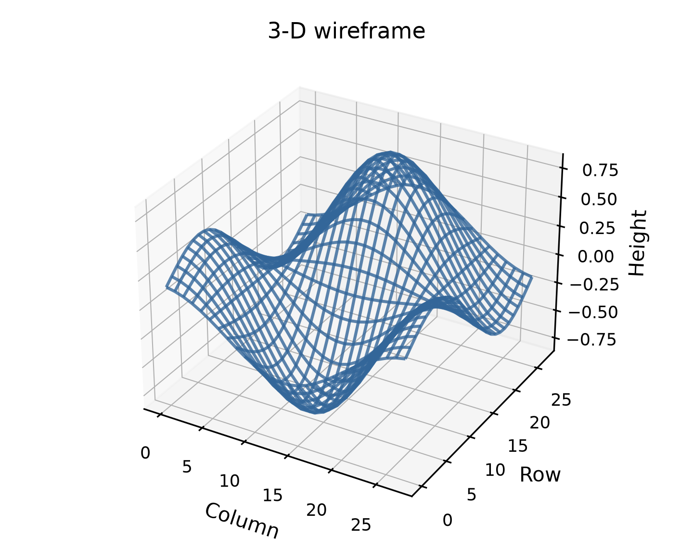

A matrix surface is represented by a lightweight line mesh.

행렬 표면을 가벼운 선 mesh로 표현합니다.

**Required / 필수:** `matrix`

**Optional / 선택:** `color`, `alpha`

<details><summary>Runnable code / 실행 코드</summary>

```python
import mudplot as mp
import numpy as np

x, y = np.meshgrid(np.linspace(-2.5, 2.5, 28), np.linspace(-2.5, 2.5, 28))
field = np.cos(x) * np.sin(y) * np.exp(-(x**2 + y**2) / 12)
plot = (
    mp.plot()
    .matrix("field", field)
    .projection3d()
    .wireframe("field", color="#336699", alpha=0.8)
    .labels(x="Column", y="Row", title="3-D wireframe")
    .zlabel("Height")
    .size(4.8, 3.8)
)
plot.save("figure.png")
```

</details>

[Editable spec / 편집 가능한 spec](images/plots/wireframe.mplot.json) · [Reference / 레퍼런스](REFERENCE.md#wireframe)
